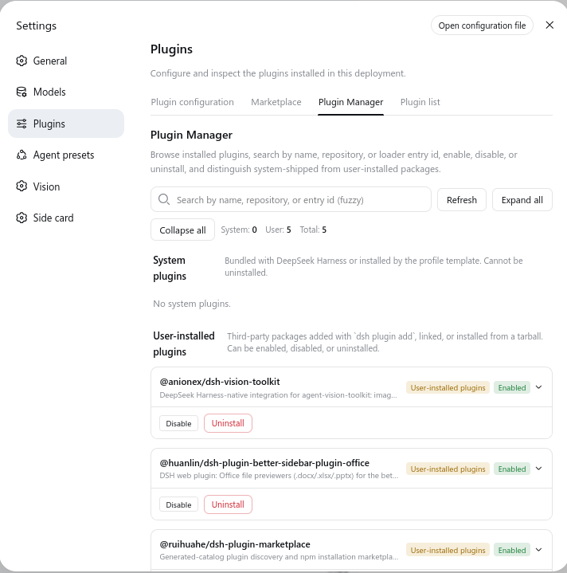

# dsh-plugin-master

English | [中文](README.zh.md)

A Web plugin manager for [DeepSeek Harness (DSH)](https://github.com/deepseek-ai/deepseek-harness). Browse installed plugins, fuzzy-search across package names, repository URLs, descriptions and loader entry ids, then enable, disable or uninstall each one. System-shipped packages and user-installed packages are separated into two groups, so you can always tell what you installed yourself.

This plugin replaces Harness's read-only `ui-settings-plugin-inventory` tab with a richer view; the inventory tab is disabled by the bundle patch and the plugin manager takes its place.



## Features

- Two-level grouping: system plugins first, then user plugins; each group can be expanded or collapsed.
- Live fuzzy search across package name, repository URL, homepage, description, author, keywords, and every loader entry id, config id and module specifier the package owns.
- Enable / disable one loader entry or the whole package. The desired state is persisted in the profile's `cordis.patch.yml` and takes effect at runtime when the loader allows; otherwise the UI tells you a restart is required — via a modal, not a barely-visible status line.
- Uninstall user packages through the same `dsh plugin --profile <name> remove <package>` command the harness launcher uses, with a confirmation dialog and a verified post-condition.
- Dependency-aware disable guard: disabling a package whose client services another enabled package still injects is refused with a clear explanation (e.g. disabling `dsh-better-sidebar` while `dsh-plugin-better-sidebar-plugin-office` depends on it).
- Distinguish the install kind (npm registry, local link, local path, git repo, tarball, workspace).
- Protected ids (the manager itself, Loader plumbing, runtime, webserver, api gateway, settings, client-runtime, locale, modules) cannot be disabled from the page; extend the set through the host config (`protectedEntries`).
- Bilingual UI (English + Simplified Chinese).

## Install

The manager ships as a bundle plugin — install it into the `web` profile the same way you install any DSH plugin:

### From this repository (local checkout, no publish needed)

```sh
git clone https://github.com/helloydh007/dsh-plugin-master.git
cd dsh-plugin-master
./install.sh          # POSIX
# or, on Windows:
# powershell -File install.ps1
```

`install.sh` links the current directory into `~/.dsh/profiles/web/node_modules/` and registers the plugin in the profile's `cordis.patch.yml` (idempotent — safe to re-run). It never downloads anything when run from inside a clone.

### From a published tarball / npm (once published)

```sh
dsh plugin --profile web add dsh-plugin-master
```

### From a local checkout via the launcher

```sh
dsh plugin --profile web add link:/absolute/path/to/dsh-plugin-master
```

Then reload the Web UI (restart `dsh web` and hard-refresh the browser). The "Plugin Manager" tab appears under **Settings → Plugins**, ahead of the (disabled) Plugin list.

## Uninstall

```sh
# if installed via npm / dsh plugin add:
dsh plugin --profile web remove dsh-plugin-master

# if installed via install.sh / symlink:
rm ~/.dsh/profiles/web/node_modules/dsh-plugin-master
# and remove the two rows the installer appended to:
#   ~/.dsh/profiles/web/cordis.patch.yml
# (the rows carry a "#Managed by dsh-plugin-master." comment)
```

Then restart `dsh web`. The official plugin list tab is restored automatically once the disabling row is removed.

## Usage

Open **Settings → Plugins → Plugin Manager**:

1. **Search** — type into the search box; the query is tokenized and matched fuzzily against names, repository slugs, descriptions and entry ids. `vision toolkit` matches `vision-toolkit`; `anionex` matches `@anionex/...`; typos still find their target via subsequence matching.
2. **Enable / disable** — use the per-entry toggle on any loader entry row, or the package-level button at the bottom of a card. The desired state is written to `cordis.patch.yml`.
3. **Uninstall** — the red button on a user-installed package card; confirm in the dialog. The host shells out to `dsh plugin remove`, then verifies the package left `node_modules`.

## Why DSH Vision Toolkit (or any hyphen-named package) was hard to search before

Harness's built-in inventory tab uses strict substring matching against only `moduleName` and `entryId`. The vision toolkit is registered as `@anionex/dsh-vision-toolkit` (entry id `vision-toolkit`), so searching for "Vision Toolkit" (with the space and capital T) returned nothing. The plugin manager:

1. Splits the query on `-_. /@:` and matches per token, so `vision toolkit` matches `vision-toolkit`, `dsh aqua` matches `dsh-client-ui-aqua`, `anionex` matches `@anionex/...`.
2. Includes each package's `repository` field from `package.json` in the searchable corpus, so searching the author or the repo slug finds the package even when its loader id is unrelated.
3. Falls back to subsequence matching when no token matches exactly.

## Development

```sh
pnpm install
pnpm typecheck
pnpm build              # builds lib/index.mjs + lib/client.cjs
pnpm build:host         # host half only (esbuild)
pnpm build:client       # browser half only (tsdown)
```

`lib/index.mjs` is the host half (Cordis + Typert); `lib/client.cjs` is the browser half (settings tab + Remote face), wrapped for the DSH module loader.

## Configuration

The host service accepts a small config block via the `plugin-master` row in your profile `cordis.patch.yml`. All keys are optional:

```yaml
- id: plugin-master
  name: dsh-plugin-master
  config:
    protectedEntries: [my-auth-provider]
    settleTimeoutMs: 8000
    uninstallTimeoutMs: 60000
```

- `protectedEntries` — additional Loader entry ids that the manager UI must refuse to disable.
- `settleTimeoutMs` — how long to wait for the runtime to reflect a toggle before reporting a required restart.
- `uninstallTimeoutMs` — process timeout for `dsh plugin remove`.

## Safety

- The host reads `cordis.patch.yml` and writes only its own marked rows; user-authored rows are never modified.
- Uninstall goes through `dsh plugin --profile <name> remove`, which runs pnpm and reconciles the bundle stack — never a direct directory deletion.
- Disabling a package that other enabled packages depend on (client services) is refused with a modal explaining the dependency chain.
- Protected ids prevent the page from disabling itself, the Cordis Loader plumbing, the API gateway, the Web server, or the harness settings shell.
- The host has no in-memory cache; every read returns a fresh snapshot from `loader.entries()` and the live `node_modules` walk.

## Known limitations

- **System detection is authoritative, not heuristic.** A package is system only when it resolves inside the real Harness install root's `@deepseek-ai/` scope. Packages in the profile `bundles` list or impersonating the `@deepseek-ai/` scope stay in the user group — that is intentional.
- **Bulk actions are per-package only.** There is no "enable / disable every user plugin" button yet.
- **Uninstall requires pnpm.** If the `dsh` launcher or pnpm are missing on the host, the uninstall button reports a failure rather than attempting a direct delete.

## License

MIT
